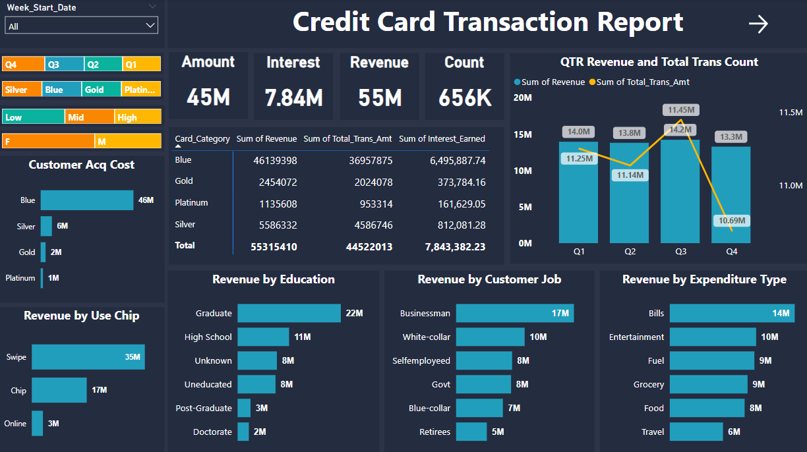
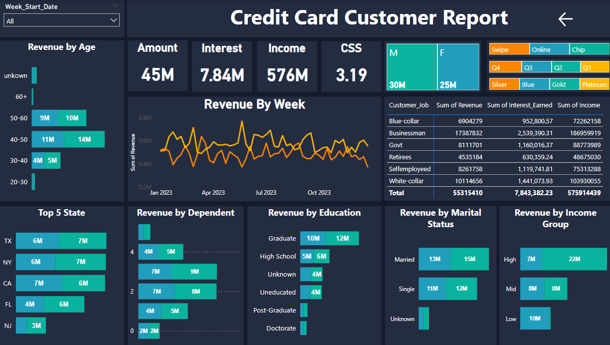

# Credit Card Financial Report

## Created by - Muzamil Channa @ Aspiring Data Analyst [Linkedin Profile](https://www.linkedin.com/in/muzamil-channa-a2216a175/)

## Table of Contents
- [Objective](#Objective)
- [Data from SQL](#Data-from-SQL)
- [Data Processing & DAX](#Data-Processing-&-DAX)
- [Dashboard & Insights](#Dashboard-&-Insights
)

## 1. Project Objective
To develop a comprehensive credit card weekly dashboard that provides real-time insights into key performance metrics and trends, enabling stakeholders to monitor and analyze credit card operations effectively.

## 2. Data from SQL
1. Prepare csv file.
2. Import csv file into SQL.

## 3. Data Processing & DAX
```DAX Queries
AgeGroup = SWITCH(
 TRUE(),
 'public cust_detail'[customer_age] < 30, "20-30",
 'public cust_detail'[customer_age] >= 30 && 'public cust_detail'[customer_age] < 40, "30-40",
 'public cust_detail'[customer_age] >= 40 && 'public cust_detail'[customer_age] < 50, "40-50",
 'public cust_detail'[customer_age] >= 50 && 'public cust_detail'[customer_age] < 60, "50-60",
 'public cust_detail'[customer_age] >= 60, "60+",
 "unknown"
 )
IncomeGroup = SWITCH(
 TRUE(),
 'public cust_detail'[income] < 35000, "Low",
 'public cust_detail'[income] >= 35000 && 'public cust_detail'[income] <70000, "Med",
 'public cust_detail'[income] >= 70000, "High",
 "unknown"
 )
week_num2 = WEEKNUM('public cc_detail'[week_start_date])
Revenue = 'public cc_detail'[annual_fees] + 'public cc_detail'[total_trans_amt] + 'public cc_detail'[interest_earned]
Current_week_Revenue = CALCULATE(
 SUM('public cc_detail'[Revenue]),
 FILTER(
 ALL('public cc_detail'),
 'public cc_detail'[week_num2] = MAX('public cc_detail'[week_num2])
 )
)
Previous_week_Revenue = CALCULATE(
 SUM('public cc_detail'[Revenue]),
 FILTER(
 ALL('public cc_detail'),
 'public cc_detail'[week_num2] = MAX('public cc_detail'[week_num2])-1
 )
)
```
# 4. Dashboard & Insights
#
  
  
#
## Overview YTD
- overall revenue is 55M 
- Total interest is 7.84M 
- Total transaction amount is 656k
- Total income: 576M
- Custormer satification score 3.19 
- Male customers are contributing more in revenue 30M, female 25M 
- Blue & Silver credit card are contributing to 93.31% of overall transactions
- TX, NY & CA is contributing to 94.18% 

## Insight: Credit Card Transaction Report - Week 52, (Dec 24)

### Total Revenue: 933k   
### Total Transaction Count: 11k

#### Key Insights:

1. **Highest Revenue by Card Category (Blue):** $77285
2. **Highest Revenue by Chip Usage:** $690,320
3. **Highest Revenue by Education (Graduate):** $383,562
4. **Highest Revenue by Customer Occupation:** $284,609
5. **Highest Revenue by Expenditure (Bills):** $221,386

---

## Credit Card Customer Report - Week 52, (Dec 24)

### Total Amount Spent: 749k
### Total Interest Paid: 137.71K  
### Total Income: 10M
### Customer Satisfaction Score: 4.21

#### Revenue Breakdown:
- Male: 558K    
- Female: 375k

#### Highest Revenue by Age Group:
- 40 - 50
  - Female: $224,346
  - Male: $348,487

#### Highest Revenue by State:
1. Texas (TX)
   - Female: $116,856
   - Male: $154,801
2. Florida (FL)
   - Female: $72,710
   - Male: $169,519

#### Highest Revenue by Number of Dependents:
- 3 Dependents
  - Female: $122,250
  - Male: $163,121
- 4 Dependents
  - Female: $97,850
  - Male: $163,121

#### Highest Revenue by Education Level:
- Graduate
  - Female: $137,576
  - Male: $245,986

#### Highest Revenue by Marital Status:
- Female: $236,711
- Male: $339,296

#### Highest Revenue by Income Group:
- Female: $114,740
- Male: $373,397


